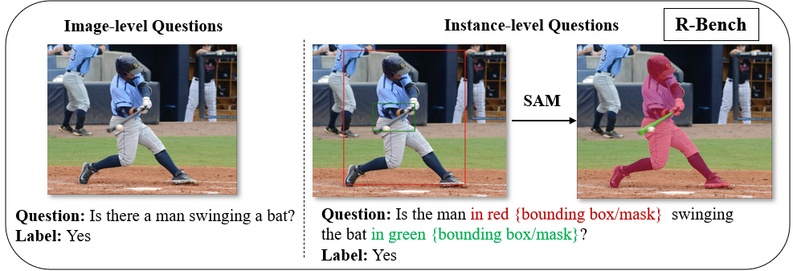

# R-Bench


This repo is for the paper [Evaluating and Analyzing Relationship Hallucinations in Large Vision-Language Models (ICML2024)](https://www.bing.com/ck/a?!&&p=2f0bd6012a4f4b51JmltdHM9MTcxOTM2MDAwMCZpZ3VpZD0zMjgwNWY0Mi03YmRkLTZkYzEtMTdmNi00YzE3N2FiYjZjODUmaW5zaWQ9NTE4OQ&ptn=3&ver=2&hsh=3&fclid=32805f42-7bdd-6dc1-17f6-4c177abb6c85&psq=Evaluating+and+analyzing+relationship&u=a1aHR0cHM6Ly9hcnhpdi5vcmcvaHRtbC8yNDA2LjE2NDQ5djE&ntb=1).

```
@InProceedings{pmlr-v235-wu24l,
  title = 	 {Evaluating and Analyzing Relationship Hallucinations in Large Vision-Language Models},
  author =       {Wu, Mingrui and Ji, Jiayi and Huang, Oucheng and Li, Jiale and Wu, Yuhang and Sun, Xiaoshuai and Ji, Rongrong},
  booktitle = 	 {Proceedings of the 41st International Conference on Machine Learning},
  pages = 	 {53553--53570},
  year = 	 {2024},
  editor = 	 {Salakhutdinov, Ruslan and Kolter, Zico and Heller, Katherine and Weller, Adrian and Oliver, Nuria and Scarlett, Jonathan and Berkenkamp, Felix},
  volume = 	 {235},
  series = 	 {Proceedings of Machine Learning Research},
  month = 	 {21--27 Jul},
  publisher =    {PMLR},
  pdf = 	 {https://raw.githubusercontent.com/mlresearch/v235/main/assets/wu24l/wu24l.pdf},
  url = 	 {https://proceedings.mlr.press/v235/wu24l.html},
  }
```


## Data
Download [R-Bench](https://drive.google.com/file/d/1sqO0MWBg_HXp5cIKb-nstjNEEk5crUWH/view?usp=sharing).
The main annotation files include:
```
- image-level_filterd.json
- instance-level_filterd.json
- nocaps_pope_obj_random_image.json
- nocaps_pope_obj_popular_image.json
- nocaps_pope_obj_adversarial_image.json
- web_data
- instance_mask
```
These files contain annotations for image-level, instance-level(box and mask share same questions), pope-object, and web-data questions. For image-level and instance-level questions, we randomly sampled five subsets into the `[type]_ids_[subset].json` files.

Download the images from [Open Image validation set (v4)](https://storage.googleapis.com/openimages/web/download_v7.html).

## Eval
**Step1:** To run LVLM on R-Bench using the official inference script of the LVLMs.

For Image-level, pseudocode is as follows,
```
for line in questions:
    question_id = line['question_id']
    question = line['text']
    image = open(line['image'])
    text = model(question, image)
    answer_file.write(json.dumps("question_id": question_id, "text":text))
```

For Instance-level, pseudocode is as follows,
```
for line in questions:
    question_id = line['question_id']
    question = instance_qs_construct(line, type='mask' if instance_level_mask else 'box')
    if instance_level_box:
      image = draw_box(line)
    if instance_level_box:
      image = draw_mask(line)
    text = model(question, image)
    answer_file.write(json.dumps("question_id": question_id, "text":text))
```

and format the result.json file as follows:
```
{"question_id": 0, "text":[model output]}
{"question_id": 1, "text":[model output]}
...
```
Tips: We provide instance-level question tools in `utils.py`. Please use the `draw_mask` and `draw_box` functions to draw the mask or box on input images, respectively. Additionally, use the `instance_qs_construct` function to reformat the instance questions.

And eval with,
```
sh eval.sh
```
Tips: You can just replace ```--result-file``` with the file you generated, and the ```eval.py``` script will automatically calculate the average results for different subsets.

## Acknowledge
The evaluation code is based on [POPE](https://github.com/AoiDragon/POPE).
